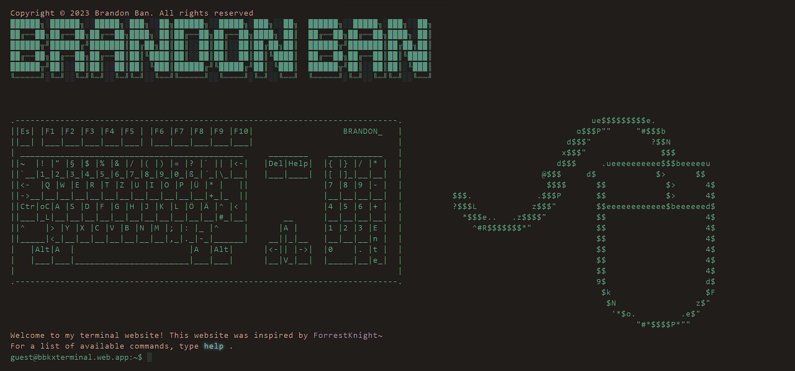

<h1 align="center">Terminal Website</h1>

Welcome to my personal terminal website! This website is built with simple HTML, CSS, and JavaScript, and it is intended to introduce myself briefly.
 
You can access the website by clicking [here](https://bbkxterminal.web.app/).

## Getting Started
To access this website, simply click on the link provided above. Once you land on the page, you will see a terminal interface where you can interact with the website.

You can type `help` to see a list of available commands, or you can type ls to see a list of files on the website.

## Features
- Simple terminal interface
- Interactive commands
- Responsive design
- Easy to navigate

## Commands
Here is a list of available commands:

- `whois`: Displays a brief introduction about me
- `bbkx`: Opens a new tab with my portfolio website
- `projects`: View Coding Projects
- `social`: Display Social Networks
- `history`: View command history
- `help`: Display a list of available commands
- `email`: Contact me via Email
- `clear`: Clear terminal
- `banner`: Display the header shown above
- `LinkedIn`: Contact me via LinkedIn
- `GitHub`: Discover more projects on my GitHub profile
- `Facebook`: Contact me via Facebook
- `Instagram`: Contact me via Instagram
- `bmttuxd`: Unveil the obscurity that lies within me

## Contributions
If you find any issues or have suggestions for improving this website, feel free to open an issue or create a pull request on the [GitHub repository](https://github.com/bbkx226/terminalWebsite.git).

## Author
This website was created by Brandon Ban. You can learn more about me by typing `whois` in the terminal or by visiting my [GitHub profile](https://github.com/bbkx226).

## License
This project is licensed under the [MIT License](https://opensource.org/license/mit/) - see the LICENSE file for details.
